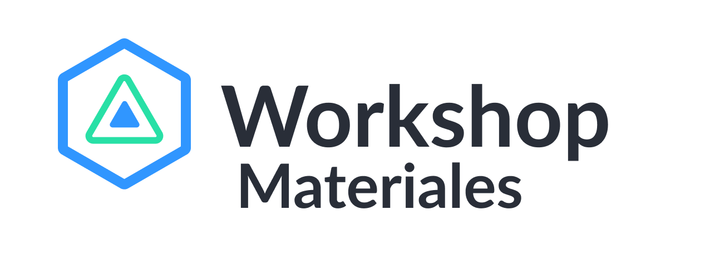

> ### Los materiales de todas nuestras actividades

### Index

-   [Materiales](#)
    -   [¿Qué es Workshop](#qué-es-workshop)
    -   [Talleres](#nuestros-talleres)
    -   [Cursos](#nuestros-cursos)

### ¿Qué es Workshop?
Workshop es una organización centrada en crear conexiones entre personas y oportunidades de crecimiento académico y profesional, desarrollando actividades con la ayuda de empresas de tecnología, instituciones académicas y estudiantes.

#### ¿Cuáles son nuestros objetivos?
* Formar gente autodidacta.
* Desarrollar actividades que incentiven a la participación en actividades extraescolares y el aprendizaje de nuevas habilidades.
* Facilitar la capacitación necesaria que los ayude a la incorporación al ambiente profesional.
* Generar vinculación entre estudiantes y personas del ámbito profesional.   
* Compartir y generar experiencias significativas entre los estudiantes.

#### ¿Qué se necesita para formar parte de los talleres?
* El alumno debe ser proactivo.
* El alumno debe estar dispuesto a participar.
* El alumno se comprometerá con aportar conocimiento en la clase sobre alguna tecnología que desee.

### Nuestros Talleres
* [¿Qué quiero programar?](/Talleres/que-quiero-programar/main.md)
* [Mi amiga la terminal](/Talleres/Mi_amiga_terminal/Page1.md)
* [Introducción Git](/Talleres/Git/Page1.md)
* [Cuentos de Javascript](/Talleres/CuentosDeJavascript/1.-home.md)
* [Tu primer lenguaje: JavaScript](/Talleres/Mi_primer_lenguaje_Javascript/Page1.md)
* [Lo básico de HTML & CSS](/Talleres/html-css/Inicio.md)
* [Lo básico de Foundation 6](/Talleres/foundation/page1.md)
* [Lo básico de Firebase](/Talleres/firebase/index.md)
* [Lo básico de Heroku](/Talleres/heroku/INDEX.md)
* [Conoce Atom - El editor de texto de GitHub](/Talleres/Taller-Atom/README.md)
* [Conoce Latex - Crea documentos de calidad](/Talleres/IntroduccionLatex/index.md)
* [Facebook Bots](/Talleres/facebook-bots/README.md)
* [Gulp](/Talleres/gulp/Page1.md)
* [PostCss](/Talleres/PostCss/Main.md)
* [Polymer](/Talleres/Polymer/README.md)
* [Tecnologías de Documentación](/Talleres/Documentacion/PAGE1.md)
* [Servicios Web con NodeJS](/Talleres/web-services/README.md)
* [Introducción Java](/Talleres/Java/inicio.md)

### Nuestros Cursos
* [Python: from zero to hero](https://github.com/VictorLaraL/PythonBegginers)
* [Tu primera webapp](https://github.com/MiguelRAvila/MiPrimeraAplicacionWeb/blob/master/1.-home.md)
