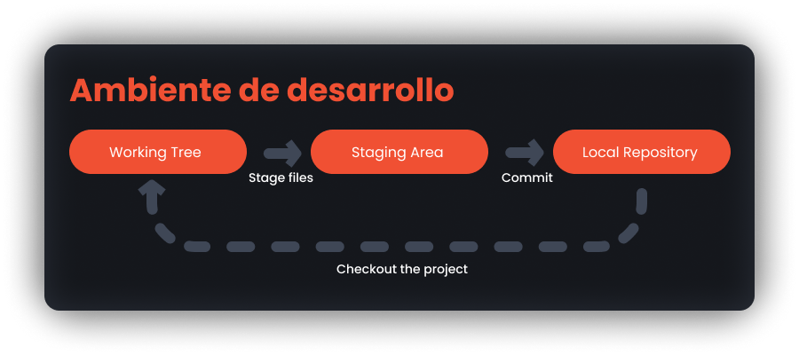

# Introducción a Git
## Hola VCS's

Un sistema de control de versiones (_version control system_ o _VCS_) es una herramienta de software que nos ayuda a llevar un control del desarrollo de un código a lo largo del tiempo. Los VCS llevan un registro sobre cada modificación del código en una base de datos especial de cada sistema.
En esencia, hablamos de una herramienta que nos permite volver a versiones anteriores de nuestro proyecto, es decir, nos da la habilidad de volver en el tiempo.

Nos permite:

* Revertir archivos, proyectos enteros a un estado anterior.
* Comparar cambios a través del tiempo.
* Ver quien ha modificado o ha introducidos errores en el proyecto.
* Etc.

## Estados de trabajo

 
    

* **Working tree:** El working tree simplemente son todos los archivos de la carpeta en la que se encuentra el .git. En este caso es una representación de todos los posibles archivos que podrían agregarse al repositorio local.
* **Staging area:** En esta parte se deben definir los archivos junto con su estado para la siguiente versión del proyecto, en esencia, puedes describirlo como darle ordenes a git para saber que archivos se incluiran y si quieres omitir alguno de ellos.
* **Local Repository:** Esta es la fase donde se almacenan los metadatos y los estados de los archivos, actuando como una base de datos para la gestión del proyecto.

***

## [Anterior 👈](README.md)  -  [👉 Siguiente](Page3.md)