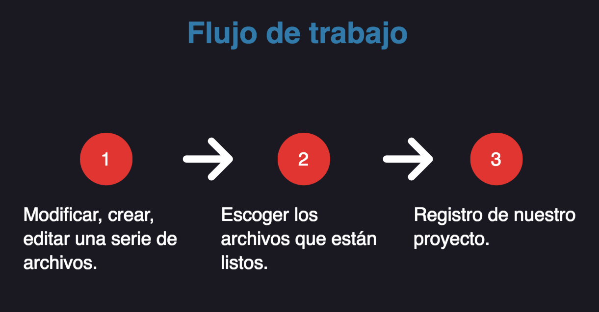

#Introducción a Git
##¿Qué es?

Es un sistema de control de versiones. Éste nos registra los cambios realizados en un archivo o conjunto de archivos.

Nos permite:

* Revertir archivos, proyectos enteros a un estado anterior.
* Comparar cambios a través del tiempo.
* Ver quien ha modificado o ha introducidos errores en el proyecto.
* Etc.

##Estados de trabajo

* **Working directory:** Aquí es donde editamos y trabajamos con nuestros proyectos.
* **Staging area:** Aquí es donde escogemos que archivos están listos para pasar al tercer estado, al igual que decidimos que archivos no están listos por el momento.
* **Repository:** Aquí es el registro de todo nuestro proyecto.
 

## [Anterior](Page1.md)  --  [Siguiente](Page3.md)