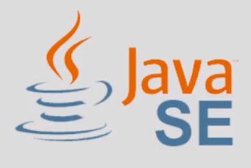

# Versiones de Java

## - Java SE

## - Java J2ME

# Java Enterprise Edition

Java EE es un conjunto de API’s enfocadas en brindar servicios empresariales como: transaccionalidad, seguridad, interoperabilidad, persistencia, objetos distribuidos, entre muchos servicios más. 
 
Un API (ApplicationProgramming Interface) es un conjunto de clases que resuelven una necesidad muy particular. Por ejemplo el API de JDBC
permite crear código Java para establecer la comunicación con una base de datos.

En resumen, la versión empresarial de Java se puede entender como una extensión de la versión estándar (JSE), pero con la
intención de facilitar el desarrollo de aplicaciones empresariales, permitiendo agregar de manera muy simple los servicios
descritos anteriormente, y así crear aplicaciones Java robustas, poderosas, y de alta disponibilidad.

## [Siguiente](page3.md)

