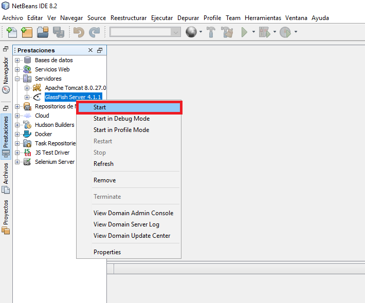
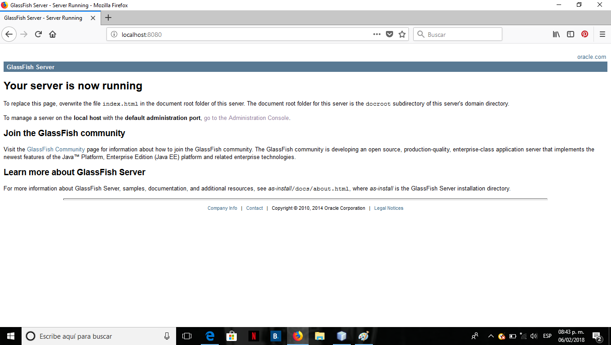

# Configuración del Entorno de Desarrollo

Como primer paso es necesario tener instalado java, el jdk, un IDE.

## Netbeans

En en este taller se utilizara Netbeans en su edición Java EE como IDE. 

Abrir el Netbeans. Por defecto la edición Netbeans Java EE nos trae los servidos GlassFish Server Open Source Edition 4.1.1
Y Apache Tomcat 8.0.27. Verificamos el servidor GlassFish hacemos los siguiente:

Abrimos el navegador con lo siguiente: localhost:8080

si nos aparece los siguiente quiere decir que el servidor esta funcionando de manera correcta.

## [Siguiente](page4.md)
