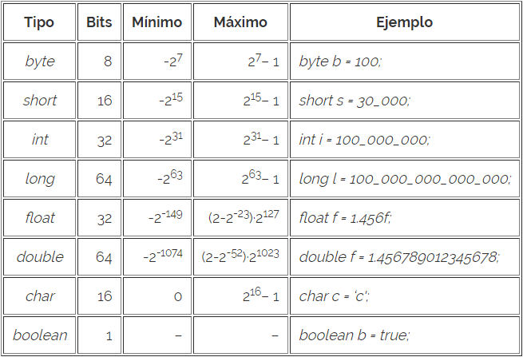

# Tipos de Datos Primitivos
### ¿Qué son los tipos de datos primitivos en Java?
Java es un lenguaje de tipado estático. Es decir, se define el tipo de dato de la variable a la hora de definir esta. Es por ello que todas las variables tendrán un tipo de dato asignado.

El lenguaje Java da de base una serie de tipos de datos primitivos.

Hay un tipo de dato String para el manejo de cadenas que no es en sí un tipo de dato primitivo. Con el tipo de dato String podemos manejar cadenas de caracteres.
El String no es un tipo de dato primitivo del lenguaje Java. Pero su uso es igual de importante que el de los tipos de datos revisados aquí. Veremos más en detalle el uso del tipo String.

## [Anterior](page1.md)  --  [Siguiente](page3.md)