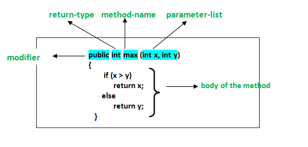

# Métodos 
Un método es una colección de declaraciones que realizan alguna tarea específica y devuelven el resultado a la que la llama. Un método puede realizar una tarea específica sin devolver nada. Los métodos nos permiten reutilizar el código sin volver a escribir el código.

En general, las declaraciones de métodos tienen seis componentes:
- Modificador: define el tipo de acceso del método, es decir, desde dónde se puede acceder en su aplicación. En Java, hay 4 tipos de especificadores de acceso.
	- public: accesible en toda clase en su aplicación.
	- protected: accesible dentro de la clase en la que se define y en sus subclases
	- private: accesible solo dentro de la clase en la que se define.
	- predeterminado: accesible dentro de la misma clase y paquete dentro del cual se define su clase.
- El tipo de retorno: el tipo de datos del valor devuelto por el método o void si no devuelve un valor.
- Nombre del método: las reglas para los nombres de campo se aplican también a los nombres de métodos, pero la convención es un poco diferente.
- Lista de parámetros: la lista separada por comas de los parámetros de entrada se define, precedida por su tipo de datos, dentro del paréntesis adjunto. Si no hay parámetros, debe usar paréntesis vacíos ().
- Lista de excepciones: las excepciones que espera por el método pueden arrojar, puede especificar estas excepciones.
- Cuerpo del método: está encerrado entre llaves. El código que debe ejecutarse para realizar sus operaciones previstas.

## [Anterior](page7.md)  --  [Siguiente](page9.md)