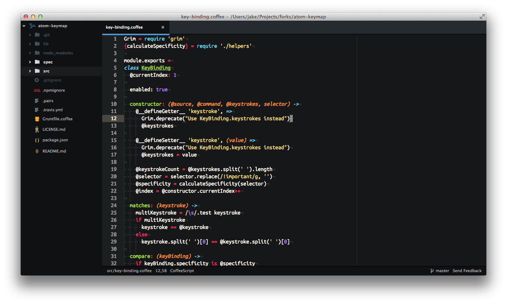

# Configuración e Instalación de Atom

Descargamos Atom para nuestro Sistema Operativo


## Windows
Para la instalación de Atom en windows necesitamos el .exe:

* Descargamos el 

y simplemente lo instalamos.

### En caso de querer tenerlo portable:

* Descargar 

* Extraer el zip en la memoria Externa

	```
	e:\atom-1.14\atom.exe
	e:\ .atom
	```

* Y crear (En caso de no tener una cofiguración previa de Atom) una carpeta que se llamara .atom 
  o copiar la configuración (carpeta ``` .atom ```) que se tiene en la computadora, en la direccion: 

  ```
  C:\Users\%Usuario%
   ```


## Mac
* Descargamos el 

La primera vez que abras Atom, tratara de instalarse los comandos ``` atom ``` y ``` apm ``` para usarlos en la terminal

Para comprobrar que Atom puedo instalar el comando ``` atom ```, abre la terminal y escribe ``` which atom ```. Si el comando ``` atom ``` fue instalado corectamente se mostrara lo siguiente:

```
$ which atom
/usr/local/bin/atom
$
```
Si el comando ``` atom ``` no fue instalado, el comando ``` which ``` no regresara nada.

```
$ which atom
$ 
```

Para instalar los comandos ``` atom ``` y ``` apm ```, presiona ``` ctrl + shift + P ``` y escribe ``` Window: Install Shell Commands ```

### En caso de querer tenerlo portable:

* Extraer el zip en la memoria Externa

	```
	/MyUSB/atom-1.14/atom.app
	/MyUSB/.atom
	```
* Y crear (En caso de no tener una cofiguración previa de Atom) una carpeta que se llamara .atom 
  o copiar la configuración (carpeta ``` .atom ```) que se tiene en la computadora, en la direccion: 

  ```
  /Users/%Usuario%
  ```



## Linux

* Debian y Ubuntu (deb/apt)

Instalar Atom en Debian, Ubuntu o Sistemas relacionados que utilice la paqueteria deb/apt

```
# Install Atom
$ sudo dpkg -i atom-amd64.deb

# Install Atom's dependencies if they are missing
$ sudo apt-get -f install
```

* RedHat y CentOS (yum)
Instalar Atom en CentIS, Oracle Linux, RedHat Enterprise Linux o sistemas relacionados que usan la paqueteria yum 

```
$ sudo yum install -y atom.x86_64.rpm
```

* Fedora (dnf)
Para instalar la ultima version de Atom para Fedora o otro sistema relacionado que utilice la paqueteria DNF

```
$ sudo dnf install -y atom.x86_64.rpm
```

##[Siguiente](PAGE2.md)
##[Pagina principal](README.md)
