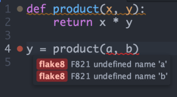

# Convertir Atom en IDE

## Para C/C++

### gpp-compiler

Esta paqueteria te permite compilar y ejecutar codigo en C/C++ en el editor de texto.

Para compilar, presiona <kbd>F5</kbd> o haz click derecgo `Compile and Run`.

## Dependencias

Este paquete se basa en el compilador de C / C++ (gcc).

### Linux

La coleccion compilador GNU  deberia venir con la distribución.
Ejecuta `which gcc g++`

Si el comando no muestra

```
/usr/bin/gcc
/usr/bin/g++
```

Necesitaras intalarlo

Para RHEL-based distros, ejecutar `sudo dnf install gcc gcc-c++`.

Para Debian-based distros, ejecutar `sudo apt install gcc g++`.

Para Arch-based distros, ejecutar `sudo pacman -S gcc`.

### Windows

Tendras que instalar [MinGW](http://www.mingw.org/) y [agregarlo a tu PATH](http://www.howtogeek.com/118594/how-to-edit-your-system-path-for-easy-command-line-access/).

### Mac

Tendras que instalar [XCode](https://developer.apple.com/xcode/).

## Para Python

Tendremos que instalar un Linter el cual nos servira para que nos muestro los errores de nuestro codigo.



Para instalar esto solo tendremos que poner estos comandos en el cmd:
```
$ apm install linter

$ pip install flake8
$ pip install flake8-docstrings
$ apm install linter-flake8
  ```
Una vez hecho esto, reiniciamos Atom.

Si habres Atom y aparece un error que dice `The linter binary flake8 cannot be found`

Tendras que ir al `init Script` de Atom, presionas <kbd>ctrl</kbd> + <kbd>shift</kbd> + <kbd>P</kbd> y escribes `Init Script`
una vez ya estemos en el `ini Script`tendremos que escribir

```
process.env.PATH = ['/usr/local/bin/', process.env.PATH].join(':')
```

Reiniciamos Atom y deberia funcionar.

Podemos ejecutar nuestro codigo instalando la paqueteria `Script`

 ```
  $ amp install script
  ```

Lo que queramos ejecutar lo seleccionamos y presionamos <kbd>shift</kbd> + <kbd>ctrl</kbd> + <kbd>b</kbd>

##[Anterior](PAGE2.md) - - [Siguiente](PAGE4.md)
##[Pagina principal](README.md)
