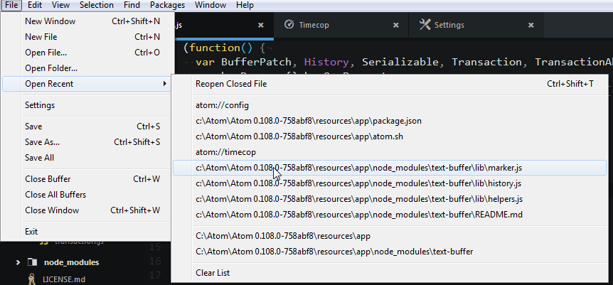
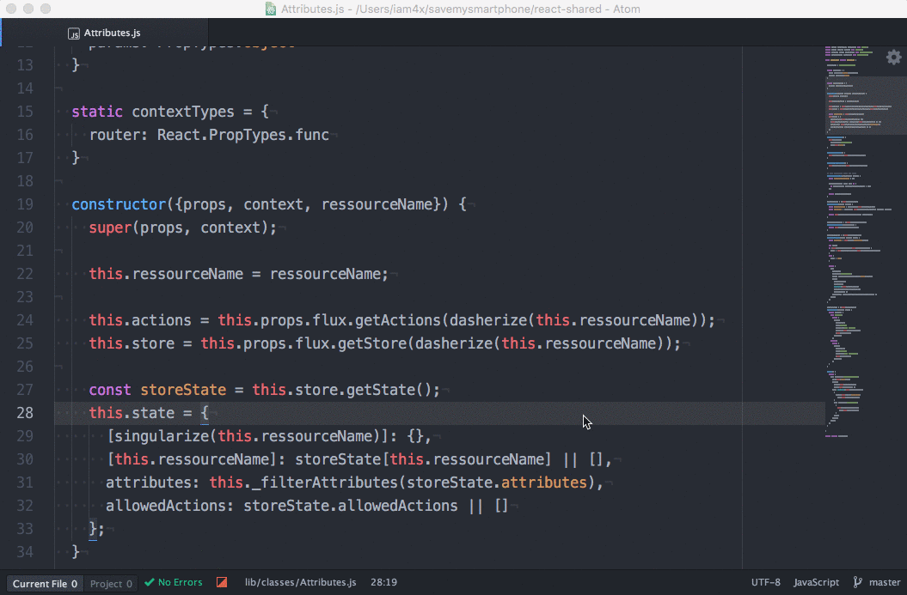

# Add-Ons para Atom

## Open Recent

  La paqueteria Open Recent simplemente habilita la opcion de abrir los archivos que se han abierto
  recientemente:

  

## TODO-Show

La paqueteria TODO-Show revela los comentarios hechos en los proyectos que contengan palabras clave como
`TODO`, `FIXME` y `CHANGED`, pero igual puedes poner tus propias palabras clave:

  

## Minimap

  La paqueteria Minimap muestra  del codigo

  

## Highlight Selected

  Esta paqueteria marca todas las palabras clave o variables en la cual este el puntero.

  

## Linter

  Existe una gran variedad de paquetes linter para cada lenguaje de programación

  
  
## [Anterior](PAGE3.md)
## [Pagina principal](README.md)
