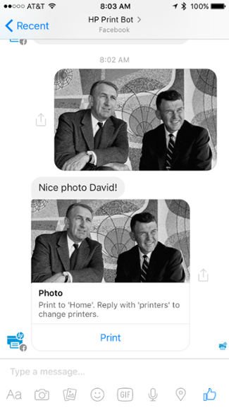
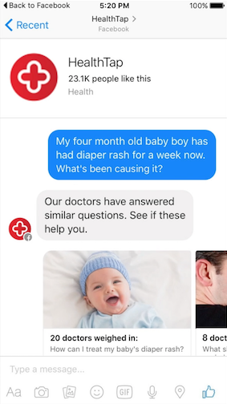
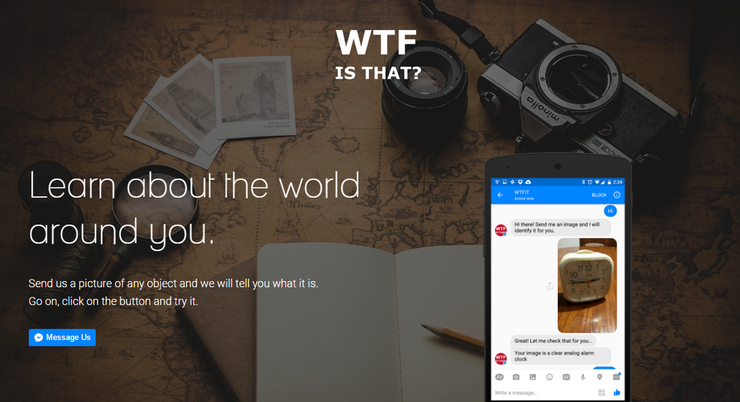
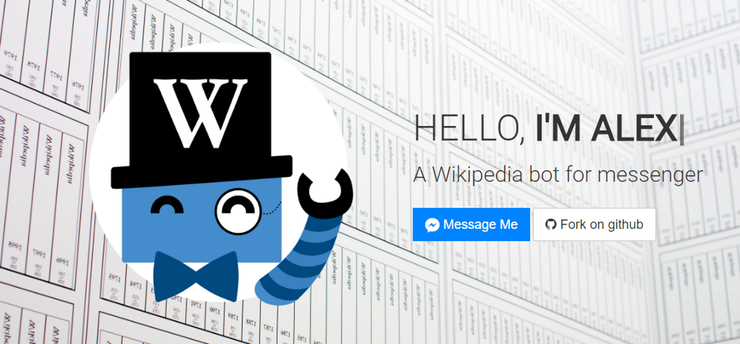
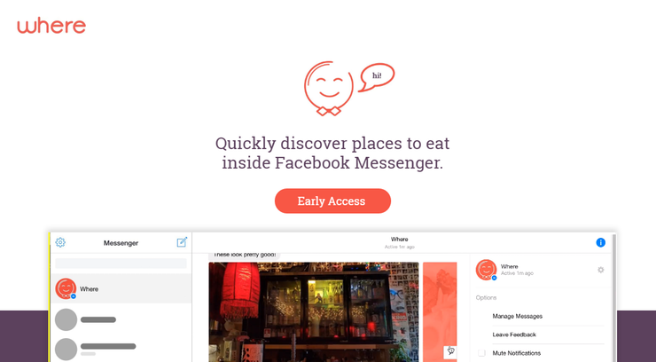

# ¿Qué es un Bot?

Como Zuckerberg ha mencionado:

> Nadie quiere tener que instalar una nueva aplicación para cada una de los negocios o servicios con los que desea interactuar

Un "Bot" es un término generalizado y usado para describir cualquier sistema software que automatiza una tarea. Un "Chatbot" automatiza una conversación, o al menos las principales partes de una.

## 5 Bots en Facebook Messenger

Las definiciones escritas sobre lo que son los "Bots" o "Chatbots" pueden parecer incompletas, por eso a veces algunos ejemplos ayudan a entender como estos sistemas de software funcionan.

#### HP

La empresa HP implementó un bot para Facebook Messenger que le permite a sus usuarios imprimir fotos, documentos y archivos desde el chat de Facebook Messenger hacia cualquier impresora HP conectada.

#### Healthtap

Healthtap es un proveedor de salud interactivo que conecta a los usuarios con el asesoramiento de profesionales médicos. Healthtap creó un bot que permite a los usuarios escribir una pregunta médica en Facebook Messenger y recibir una respuesta gratuita de un médico o navegar por artículos de preguntas similares.

El usuario de este ejemplo está preguntando en `lenguaje natural` sobre un problema de salud específico. Desde el punto de vista del usuario, esto es similar a enviar mensajes de texto a un amigo.

#### WTF Is That

Simplemente envíe al bot una imagen de algo que se quiere identificar, y unos minutos más tarde te envía una respuesta.

#### Alex WikiMessenger

Nunca ha sido tan fácil caer en una espiral de Wikipedia como lo es con el bot de Facebook Alex WikiMessenger. Dile al bot lo que estás buscando, y saca enlaces a varios artículos de Wikipedia.

#### Where

El bot rápidamente busca en Internet recomendaciones de restaurantes basadas en su ubicación y el tipo de comida que está buscando. Es cierto que no es la idea más original, pero el bot responde con bastante rapidez y profundidad.

## ¿Deberíamos construir un Bot?

Construir un bot para Facebook Messenger, como cualquier esfuerzo de marketing o producto, va a tomar los recursos, principalmente el tiempo y la experiencia del personal, y puede no resultar en los resultados que nos gustaría ver.

Para saber si debemos construir un Bot debemos preguntarnos:

##### ¿Tenemos un caso de uso claro?

Una de las razones más grandes por lo que muchas empresas se *pierden en el camino* de la construcción de aplicaciones para sus negocios es que lo vieron como sólo otra versión de su sitio web. No se tomaron el tiempo para estudiar cómo estar en un dispositivo móvil cambiaría los tipos de interacciones que sus clientes querrían tener con su compañía.

Algunas tareas no son adecuadas para móviles. Como resultado, muchas aplicaciones no se utilizaban. Cuando piensas en un caso de uso de Facebook Messenger, asegúrate de pensarlo desde el punto de vista del cliente o del usuario, no desde el punto de vista de la empresa.

##### ¿Nuestra audiencia está en Facebook?

Esta pregunta es a menudo demasiado rápidamente rechazada por las empresas que ven Facebook como una plataforma puramente social, en lugar de una para las empresas. Incluso si su público no utiliza actualmente Facebook para las necesidades del negocio, debemos comenzar por determinar si el potencial existe o no.

Si tenemos una audiencia que utiliza Facebook en gran medida en su vida personal, es probable que adopten Messenger como una herramienta de comunicación. Y cómo utilizan Messenger puede expandirse más allá de cómo utilizan Facebook. Hoy en día, el uso de aplicaciones de mensajería en realidad ha superado a las redes sociales. Y a medida que surgen nuevos casos de uso, el comportamiento evoluciona con ellos.

## [Anterior](INDEX.md) - - [Siguiente](PAGE2.md)
