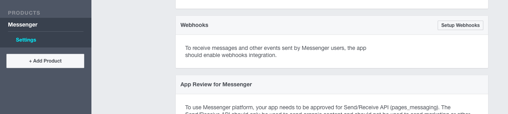
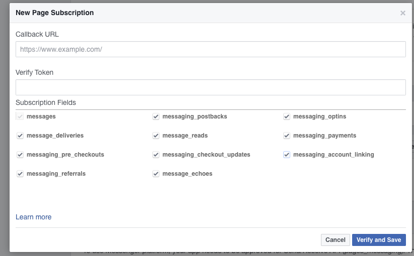
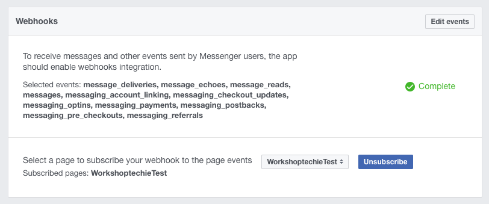

# Configuración

Los Bots de Messenger usan un servidor web pra procesar los mensajes que reciben o para configurar los mensajes que enviará. Además necesitamos que el Bot (servidor) se autentique para comunicarse con los servidores de Facebook.


### Configurar el Servidor

*Nota: El código base con la configuración del servidor lo puedes encontrar [aquí](https://github.com/LuisBurgos/workshoptechie/tree/master)*

1. Debemos instalar la herramienta [Heroku toolbelt](https://toolbelt.heroku.com) y contar con una cuenta de Heroku. Puedes seguír el [taller de Heroku](https://github.com/AdrianLeyva/workshop-technology/blob/master/Talleres/heroku/PAGE3.md) para configurar este paso.

2. Instalar Node entrando a https://nodejs.org esto nos servirá para implementar la aplicación servidor. Al finalizar la instalación debemos abrir la Terminal y asegurarnos de que tenemos instalada la versión más reciente de `npm` el cual es el manejador de paquetes para NodeJS.

  ```
  $ sudo npm install npm -g
  ```

3. Crear una nueva carpeta para el proyecto y ejecutar el siguiente comando para iniciar nuestro proyecto de Node:

  ```
  $ npm init
  ```

4. Instalar algunas dependencias necesarias para nuestro servidor:

  ```
  $ npm install express request body-parser --save
  ```

5. Crear un archivo llamado `index.js` dentro de la carpeta de nuestro proyecto y copiar el siguiente código:

  ```javascript
  'use strict'

  const express = require('express')
  const bodyParser = require('body-parser')
  const request = require('request')
  const app = express()

  app.set('port', (process.env.PORT || 5000))

  // Process application/x-www-form-urlencoded
  app.use(bodyParser.urlencoded({extended: false}))

  // Process application/json
  app.use(bodyParser.json())

  // Index route
  app.get('/', function (req, res) {
    res.send('Hello world, I am a chat bot')
  })

  // for Facebook verification
  app.get('/webhook/', function (req, res) {
    if (req.query['hub.verify_token'] === 'my_voice_is_my_password_verify_me') {
      res.send(req.query['hub.challenge'])
    }
    res.send('Error, wrong token')
  })

  // Spin up the server
  app.listen(app.get('port'), function() {
    console.log('running on port', app.get('port'))
  })
  ```

6. Crear un archivo llamado `Procfile` y copiar la siguiente línea. Esto es para que Heroku pueda ejecutar nuestra aplicación.

  ```
  web: node index.js
  ```

7. Registrar todos los cambios con `git` y crear una nueva aplicación de Heroku:

  ```
  git init
  git add .
  git commit --message "Base bot server"
  heroku create
  git push heroku master
  ```

### Configurar la Página de Facebook

Crear o configurar una página de Facebook o aplicación de Facebook en https://developers.facebook.com/apps/


*Nota: Nombra la aplicación de la misma forma que tu página de Facebook.*

En la aplicación que recién hemos creado debemos ir a la apción `Messenger` en la sección de `Productos` y hacer click en la opción `Setup Webhooks`. Aquí pondremos la URL de nuestra aplicación de Heroku y un token. Debemos marcar todas las opciones de subscripción.





Obtener el Token de Acceso de la Página y mantenerlo a mano.

Abre tu terminal y ejecuta el siguiente comando usando el Token del paso anterior:

  ```
  curl -X POST "https://graph.facebook.com/v2.6/me/subscribed_apps?access_token=<PAGE_ACCESS_TOKEN>"
  ```

### Configurar el Bot

*Nota: El código base con la configuración de envío de mensajes lo puedes encontrar [aquí](https://github.com/LuisBurgos/workshoptechie/tree/first-version)*

Finalmente para que Facebook y Heroku puedan comunicarse debemos agregar una función a nuestro bot.

Debemos agregar un endpoint al archivo `index.js` para procesar los mensajes. Debemos incluir el token que obtuvimos en pasos anteriores.

```javascript
app.post('/webhook/', function(req, res) {
    let messaging_events = req.body.entry[0].messaging
    for (let i = 0; i < messaging_events.length; i++) {
        let event = req.body.entry[0].messaging[i]
        let sender = event.sender.id
        if (event.message && event.message.text) {
            let text = event.message.text
            sendTextMessage(sender, "Text received, echo: " + text.substring(0, 200))
        }
    }
    res.sendStatus(200)
})

const token = process.env.FB_PAGE_ACCESS_TOKEN
```

Además, debemos crear un archivo con el nombre `.env` y agregar el Token que obtuvimos de la siguiente forma:

    FB_PAGE_ACCESS_TOKEN=<NUESTRO TOKE DE LA PAGINA>


Luego, configuramos la variable de entorno en Heroku ejecutando el siguiente comando:

    heroku config:set FB_PAGE_ACCESS_TOKEN=<NUESTRO TOKE DE LA PAGINA>

Agregar una función para enviar mensajes de regreso.

```javascript
function sendTextMessage(sender, text) {
    let messageData = {
        text: text
    }
    request({
        url: 'https://graph.facebook.com/v2.6/me/messages',
        qs: {
            access_token: token
        },
        method: 'POST',
        json: {
            recipient: {
                id: sender
            },
            message: messageData,
        }
    }, function(error, response, body) {
        if (error) {
            console.log('Error sending messages: ', error)
        } else if (response.body.error) {
            console.log('Error: ', response.body.error)
        }
    })
}
```

Guardar los cambios y subirlos a Heroku

  ```
  git add .
  git commit -m 'Add method to send messages'
  git push heroku master
  ```

**Importante!** Tu aplicación de Facebook en https://developers.facebook.com/apps/ debe ser pública y estar suscrita a los Webhooks.



## [Anterior](PAGE2.md) - - [Siguiente](PAGE4.md)
