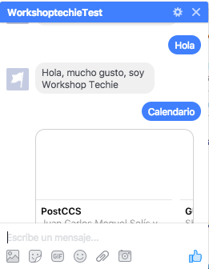
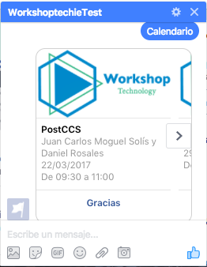

# Personalización

*Nota: El código base con la configuración de envío de mensajes lo puedes encontrar [aquí](https://github.com/LuisBurgos/workshoptechie/tree/custom-version)*

Ahora, vamos a darle un toque personalzado a nuestro bot para que nos responda con el calendario de eventos del Workshop.

Primero debemos crear un archivo llamado `data.json`, este nos servirá para almacenar la información de los cursos. *Nota: Lo correcto sería utilizar una base de datos pero para fines demostrativos utilizaremos un archivo JSON*

```json
[
  {
      "date": "22/03/2017",
      "startTime": "09:30",
      "endTime": "11:00",
      "name": "PostCCS",
      "responsable": "Juan Carlos Moguel Solís y Daniel Rosales",
      "requirements": [
        "-Llevar laptop",
        "Node js",
        "Conocimiento basico de javascript"
      ],
      "classroom": "CC5",
      "alreadyTaught": false
  },
  {
      "date": "29/03/2017",
      "startTime": "09:30",
      "endTime": "11:00",
      "name": "GULP.JS",
      "responsable": "Sheila Ricalde Pérez",
      "requirements": [
        "Llevar laptop",
        "Tener instalado NodeJS y npm"
      ],
      "classroom": "CC5",
      "alreadyTaught": false
  }
]
```

Luego, debemos crear un archivo llamado `greeting-validator.js` y agregar el siguiente código.

```javascript
'use strict'

module.exports = {
    textContainsGreeting: function(text) {
        const commonGreetings = [
            "hola",
            "hello",
            "hi",
            "alló",
            "que tal",
            "como estas",
            "buen día",
            "buenas tardes",
            "buen dia",
            "buenas noches"
        ]

        var hasGreeting = false
        for (let greeting of commonGreetings) {
            if (text.toUpperCase().indexOf(greeting.toUpperCase()) !== -1) {
                hasGreeting = true
            }

            var complexGreeting = greeting + " workshoptechie"
            if (text.toUpperCase().indexOf(complexGreeting.toUpperCase()) !== -1) {
                hasGreeting = true
            }
        }
        return hasGreeting
    }

}
```

Además, debemos crear un archivo llamado `messenger.js` y agregar el siguiente código.

```javascript
'use strict'

const request = require('request')
const token = process.env.FB_PAGE_ACCESS_TOKEN

var data = require('./data.json');

module.exports = {

    sendTextMessage: function(sender, textToSend) {

        let messageData = {
            recipient: {
                id: sender
            },
            message: {
                text: textToSend
            }
        }

        request({
            uri: 'https://graph.facebook.com/v2.6/me/messages',
            qs: {
                access_token: token
            },
            method: 'POST',
            json: messageData

        }, function(error, response, body) {
            if (!error && response.statusCode == 200) {
                var recipientId = body.recipient_id;
                var messageId = body.message_id;

                console.log("Successfully sent generic message with id %s to recipient %s", messageId, recipientId);
            } else {
                console.error("Unable to send message.");
                console.error(response);
                console.error(error);
            }
        });
    },

    sendCalendarMessage: function(sender) {
        //TODO: Improve data loading
        const firstOption = {
          "title": data[0].name,
          "subtitle": data[0].responsable,
          "date": data[0].date,
          "startTime": data[0].startTime,
          "endTime": data[0].endTime
        }
        const secondOption = {
            "title": data[1].name,
            "subtitle": data[1].responsable,
            "date": data[1].date,
            "startTime": data[1].startTime,
            "endTime": data[1].endTime
        }

        let messageData = {
            "attachment": {
                "type": "template",
                "payload": {
                    "template_type": "generic",
                    "elements": [
                        {
                            "title": firstOption.title,
                            "subtitle": (firstOption.subtitle + "\n" + firstOption.date + "\n" + "De " + firstOption.startTime + " a " + firstOption.endTime),
                            "image_url": "https://raw.githubusercontent.com/AdrianLeyva/workshop-technology/master/Imagenes/logo.png",
                            "buttons": [
                                {
                                    "type": "postback",
                                    "title": "Gracias",
                                    "payload": "Gracias"
                                }
                            ]
                        },
                        {
                          "title": secondOption.title,
                          "subtitle": (secondOption.subtitle + "\n" + secondOption.date + "\n" + "De " + secondOption.startTime + " a " + secondOption.endTime),
                            "image_url": "https://raw.githubusercontent.com/AdrianLeyva/workshop-technology/master/Imagenes/logo.png",
                            "buttons": [
                                {
                                    "type": "postback",
                                    "title": "Gracias",
                                    "payload": "Gracias"
                                }
                            ]
                        }
                    ]
                }
            }
        }

        request({
            url: 'https://graph.facebook.com/v2.6/me/messages',
            qs: {
                access_token: token
            },
            method: 'POST',
            json: {
                recipient: {
                    id: sender
                },
                message: messageData
            }
        }, function(error, response, body) {
            if (!error && response.statusCode == 200) {
                var recipientId = body.recipient_id;
                var messageId = body.message_id;

                console.log("Successfully sent generic message with id %s to recipient %s", messageId, recipientId);
            } else {
                console.error("Unable to send message.");
                console.error(response);
                console.error(error);
            }
        });
    }

};
```

Debemos asegurarnos de remover la linea `const token = process.env.FB_PAGE_ACCESS_TOKEN` del archivo  `index.js` y de importar los archivos que creamos anteriormente dentro de nuestro archivo `index.js`. El archivo `index.js` quedaría de la siguiente forma:

```javascript
'use strict'

const express = require('express')
const bodyParser = require('body-parser')
const app = express()

//Local Libs
const Messenger = require('./messenger.js')
const GreetingValidator = require('./greeting-validator.js')

app.set('port', (process.env.PORT || 5000))

// Process application/x-www-form-urlencoded
app.use(bodyParser.urlencoded({
    extended: false
}))

// Process application/json
app.use(bodyParser.json())

// Index route
app.get('/', function(req, res) {
    res.send('Hello world, I am a chat bot')
})

// for Facebook verification
app.get('/webhook/', function(req, res) {
    if (req.query['hub.verify_token'] === 'NUESTRO_TOKEN_DE_VERIFICACION') {
        res.send(req.query['hub.challenge'])
    }
    res.send('Error, wrong token')
})

app.post('/webhook/', function(req, res) {
    let messaging_events = req.body.entry[0].messaging
    console.log(messaging_events);
    for (let i = 0; i < messaging_events.length; i++) {
        let event = req.body.entry[0].messaging[i]
        console.log("Messaging event");
        console.log(event);
        let sender = event.sender.id
        if (event.message && event.message.text) {
            let text = event.message.text

            if (GreetingValidator.textContainsGreeting(text)) {
                Messenger.sendTextMessage(sender, "Hola, mucho gusto, soy Workshop Techie")
                continue
            } else if (text.toUpperCase().indexOf("Gracias".toUpperCase()) !== -1) {
                Messenger.sendTextMessage(sender, "De nada, estoy para servirte!")
                continue
            } else if (text.toUpperCase().indexOf("Calendario".toUpperCase()) !== -1) {
                Messenger.sendCalendarMessage(sender)
                continue
            } else {
              Messenger.sendTextMessage(sender, "Para comenzar escribre 'Hola'")
              continue
            }
        }

        //TODO: Improve postback handler
        if (event.postback) {
            let text = JSON.stringify(event.postback)
            if(text.toUpperCase().indexOf("Gracias".toUpperCase()) !== -1){
                Messenger.sendTextMessage(sender, "De nada, estoy para servirte!")
                continue
            }
            continue
        }

    }
    res.sendStatus(200)
})

// Spin up the server
app.listen(app.get('port'), function() {
    console.log('running on port', app.get('port'))
})
```

Finalmente debemos guardar los cambios y subirlos a Heroku

  ```
  git add .
  git commit -m 'Finish custom message responses'
  git push heroku master
  ```

### Capturas de Pantalla

Finalmente nuestro Bot de Facebook debe lucir como las siguientes imágenes:





## [Anterior](PAGE3.md) - - [Volver a Iniciar](README.md)
