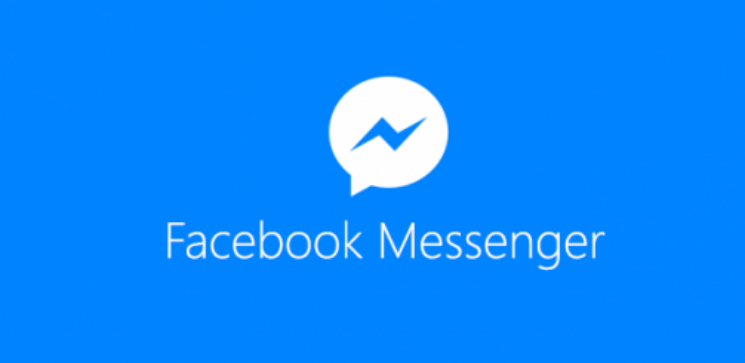

# Bots para Facebook Messenger

## Descripción

La plataforma Messenger, [anunciada en el F8](http://newsroom.fb.com/news/2016/04/messenger-platform-at-f8/) durante Abril de 2016, hace posible que los desarrolladores se conecten con los más de 900 millones de personas en todo el mundo que usan mensajería mensual.

Los Bots de Messenger son para cualquiera que esté tratando de llegar a la gente en un dispositivo móvil, no importa cuán grande o pequeño sea su empresa o idea, o qué problema está tratando de resolver. Ya sea que estemos construyendo aplicaciones o experiencias para compartir las actualizaciones del clima, confirmar reservas en un hotel o enviar recibos de una compra reciente, los bots nos permiten un enfoque más personal, más proactivo y más dinámico en la forma en que se interactúa con las personas.

Este taller está hecho para introducir a las personas a la creación de Bots para la plataforma Messenger de Facebook. En este taller se enseñarán los conceptos básicos relacionados con el desarrollo de un bot simple y los pasos para ponerlo al alcance de las personas.

## Objetivos
* Entender que puedo hacer con un Bot de Facebook.
* Configurar una página del Facebook para el Bot.
* Construir y desplegar la aplicación del Bot a Heroku.
* Solucionar problemas durante el despliegue de aplicaciones.
* Ver el Bot en acción.

## Temas

* [Acerca de los Bots](/Talleres/facebook-bots/PAGE1.md)
* [Conceptos básicos](/Talleres/facebook-bots/PAGE2.md)
* [Configuración del Bot](/Talleres/facebook-bots/PAGE3.md)
* [Personalizar el Bot](/Talleres/facebook-bots/PAGE4.md)

#### Algunas herramientas
* [Atom](https://atom.io/)
* [JSON Editor](http://www.jsoneditoronline.org/)

### [Siguiente](PAGE1.md)
