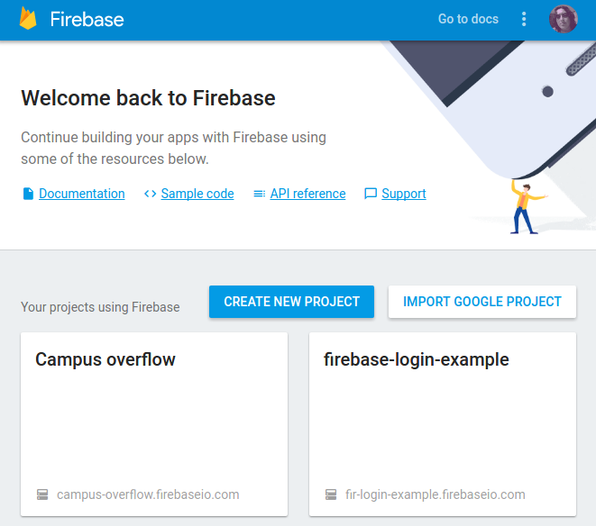
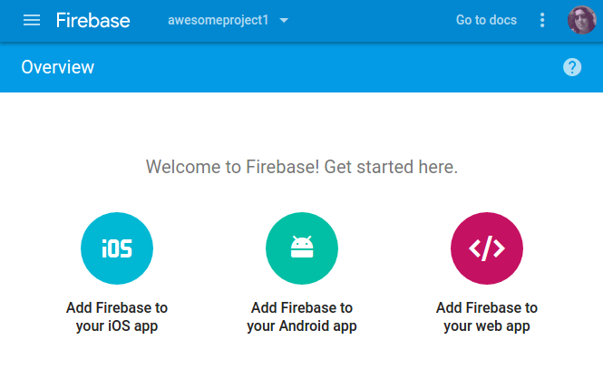

#  Firebase
##Configuración
Primero tenemos que ir a [Firebase](console.firebase.google.com) y seleccionar **create new project**



luego seleccionar **add firebase to your web app**



**copiar** el texto que aparece en el recuadro y **pegar** el código dentro de nuestro proyecto

```javascript
<script src="https://www.gstatic.com/firebasejs/3.6.6/firebase.js"></script>

<script>
  // Initialize Firebase
  var config = {
    apiKey: "XXXXXXXXXXXXXXXXXXXXXX_XXXX_XXXXXX",
    authDomain: "awesomeproject.firebaseapp.com",
    databaseURL: "https://awesomeproject.firebaseio.com",
    storageBucket: "awesomeproject.appspot.com",
    messagingSenderId: "XXXXXXXXX"
  };
  firebase.initializeApp(config);
</script>
```


## [Anterior](page0.md) - - [Siguiente](page2.md)
