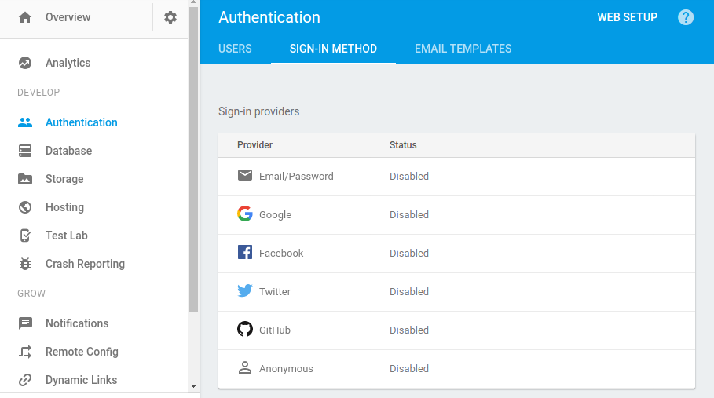

#  Firebase
## Authentication
Para configurar los proveedores de inicio de sesión debemos ir a **Authentication** → **Sign-in method** y elegimos el proveedor que deseemos


Para **crear** un usuario con Email y contraeña usaremos la función correspondiente
```javascript
firebase.auth().createUserWithEmailAndPassword(email, password);
```
Análogamente, para **iniciar sesión** con usuario y contraseña usaremos la siguiente función
```javascript
firebase.auth().signInWithEmailAndPassword(email, password);
```
Para **cerrar sesión**
```javascript
firebase.auth().signOut().then(function() {
  // La sesión se cerró
}, function(error) {
  // Error
});
```

Para acceder a los datos del usuario, podemos hacerlo de cualquiera de las siguientes maneras:

Con un **observer**
```javascript
firebase.auth().onAuthStateChanged(function(user) {
  if (user) {
    // El usuario inició sesión
  } else {
    // No hay usuario en la sesión actual
  }
});
```

o con la **propiedad**
```javascript
var user = firebase.auth().currentUser;
if (user) {
  // Hay un usuario iniciado
} else {
  // No hay usuario en la sesión actual
}
```

De cualquier forma, la manera de obtener los datos de ese usuario es accediendo a la propiedad correspondiente

```javascript
var user = firebase.auth().currentUser;
var name, email, photoUrl, uid, emailVerified;

if (user != null) {
  name = user.displayName;
  email = user.email;
  photoUrl = user.photoURL;
  emailVerified = user.emailVerified;
  uid = user.uid;
}
```

Para actualizar los datos del usuario
```javascript
// Actualizar el perfil de usuario
user.updateProfile({
  displayName: "Vicente Suárez",
  photoURL: "https://example.com/vicente-s-user/profile.jpg"
});

// Enviar un email para cambiar el email
auth.sendPasswordResetEmail('example@mail.com');
```

Para cambiar ciertos atributos se necesita re-autenticarse por seguridad
```javascript
var user = firebase.auth().currentUser;
var credential;

// Prompt the user to re-provide their sign-in credentials

user.reauthenticate(credential).then(function() {
  // Usuario re-autenticado
  // Usar una de las funciones descritas en el siguiente bloque
}, function(error) {
  // Error
});
```

```javascript
// Actualizar el email
user.updateEmail("user@example.com");

// Verificar email
user.sendEmailVerification();

// Cambiar contraseña
user.updatePassword(newPassword);

// Borrar un usuario activo
user.delete();
```
## [Anterior](page1.md) - - [Siguiente](page3.md)
