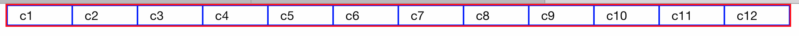

## Conceptos Básicos

## Grid
Foundation se basa en un sistema de grillas de máximo 12 columnas por fila.
Las columnas se identifican con `.column` o `.columns` (color azul) y las filas con `.row` (color rojo)



Las `.column` existen dentro de las `.row`

```html
<div class="row">
  <div class="column">
    ...
  </div>
</div>
```

## Breakpoints
Foundation incorpora 3 *breakpoints* para distintos tamaños de pantalla que existen, permitiendo así el **Responsive-Design**

Responsive-Design es la característica que se le añade a nuestras paginas web para que se ajusten a los distintos tamaños de pantalla.

|  mobile screens | >= 640 pixels | >= 1024 pixels |
| ----------------|:-------------:| --------------:|
| `small-`        | `medium-`     | `large-`       |

Otra forma de entener los puntos de ruptura(breakpoints) es:

`small-` Ajuste para pantallas de celulares.

`medium-` Ajuste para pantallas de tabletas.

`large-` Ajuste para pantallas de escritorio

#### [Anterior](page1.md) - - [Siguiente](page3.md)
