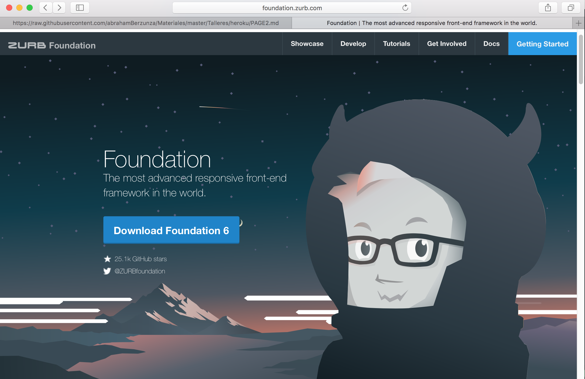
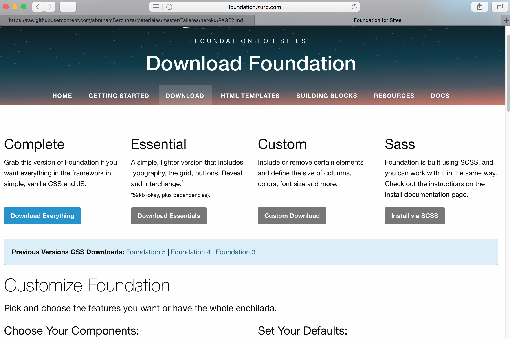
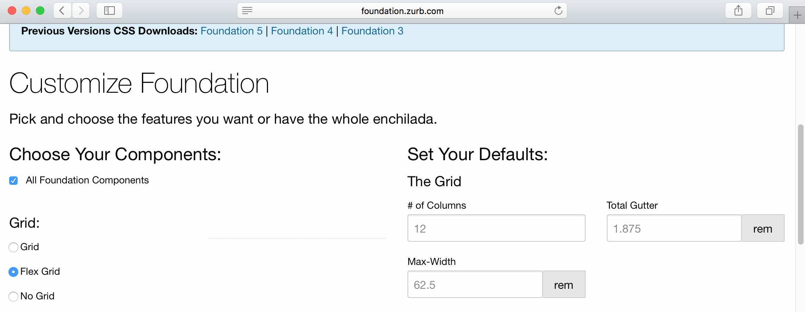
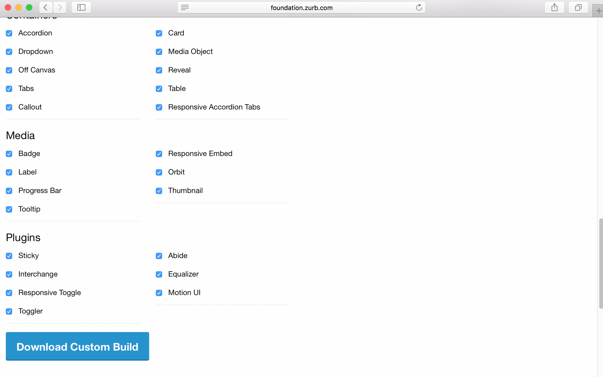
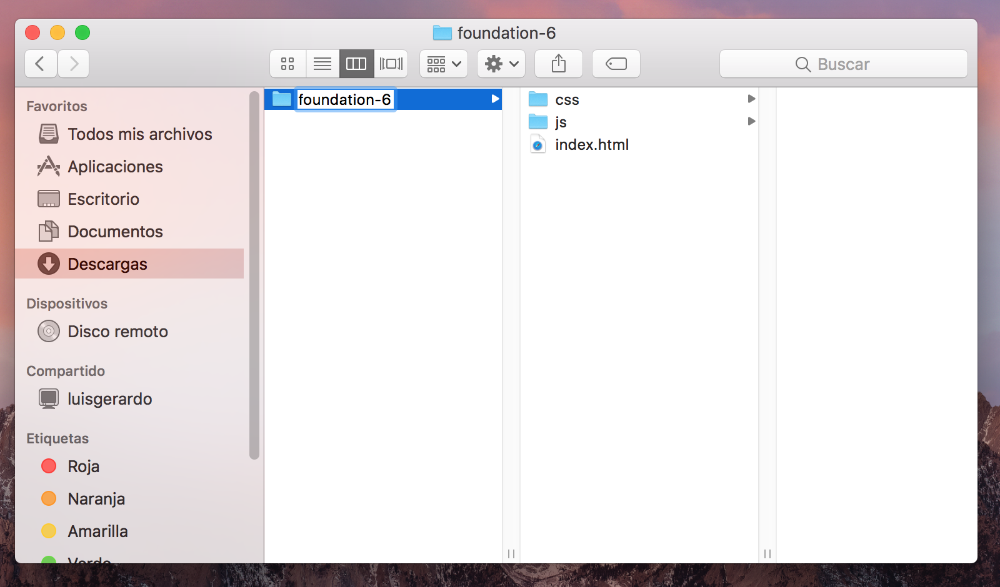
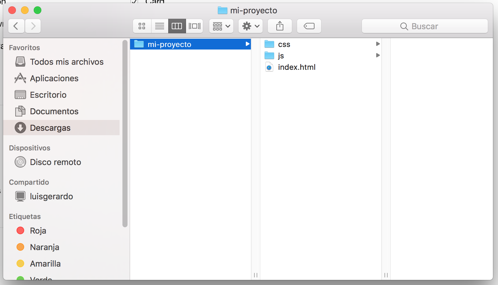
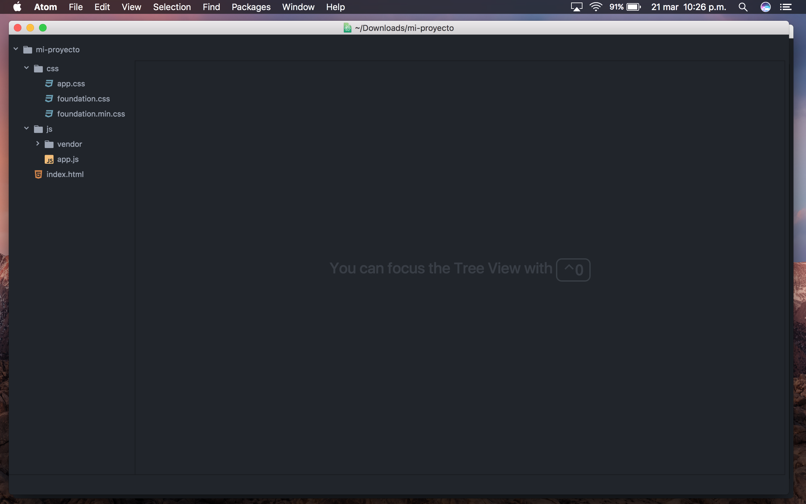

# Configuración e instalación

La siguiente configuración es recomendado para páginas de contenido estático.

Las páginas de contenido estático son aquellas donde el texto permanece de forma permanente, y solo puede ser actualizado por el desarrollador o administrador web.

Si te gustan las emociones fuertes, la empresa Zurb que desarrolló Foundation nos tiene un stack te tecnologías ya preparado. [Conoce más aquí](http://foundation.zurb.com/sites/docs/installation.html)

#### 1. Ingresamos a la página principal de Foundation.

http://foundation.zurb.com

#### 2. Damos click en ***Download Foundation 6***, lo cual nos llevara a esta página

#### 3. En la parte ***Customize foundation*** lo único que cambiaremos será ***grid*** por ***Flex-grid***

#### 4. Finalmente, hacemos click en la opción ***Download Custom Build***, la cual nos bajará un archivo .zip que hay que descomprimir

### 5. Finalmente, renombremos este archivo con el nombre de nuestro proyecto.

## Listo! Ya tenemos nuestro entorno de trabajo.

Abre el directorio en tu editor de texto favorito. El mio es atom ❤️

#### [Anterior](page3.md) - - [Siguiente](page5.md)
