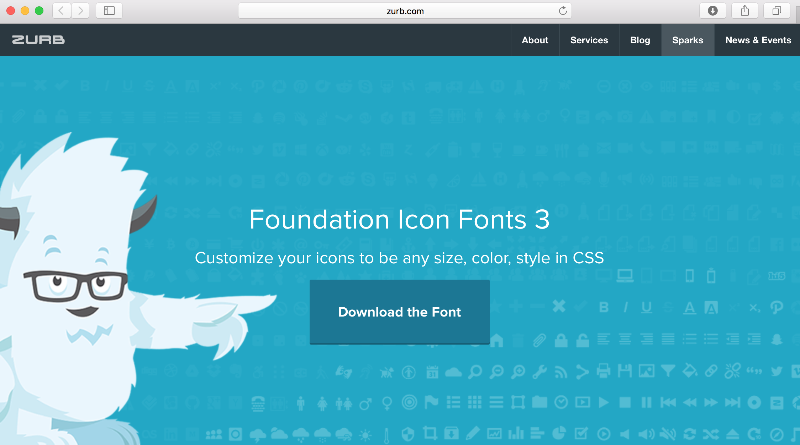

# Foundation font-icons

Una de las características que más me gusta de Foundation es que maneja un paquete de iconos, esto es una gran ventaja ya que nos ahorra estar buscando iconos para nuestra pagina por toda la ***World Wide Web***

### Agrengando el paquete de iconos a nuestro proyecto

#### 1. Nos dirigimos al enlace para descargar el paquete de iconos. Damos click en ***Download de Font***

http://zurb.com/playground/foundation-icon-fonts-3

#### 2. Una vez descomprimido el archivo, simplemente lo arrastraremos a la carpeta de nuestro proyecto

#### 3. Por ultimo, el paso más importante.

Crearemos una etiqueta **link** en nuestro archivo **index.html** de esta manera:

## Listo! Nuestro proyecto ya cuenta con el paquete de iconos.

Antes de aprender a usarlos, primero conozcamos la [estructura de nuestro proyecto.](page6.md)

#### [Anterior](page4.md) - - [Siguiente](page6.md)
