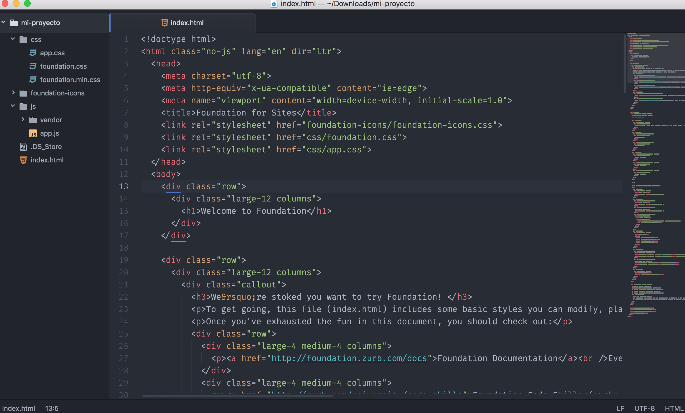
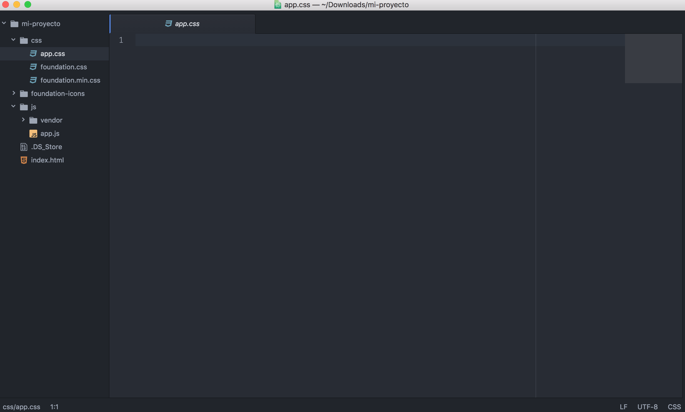

# Acerca de nuestro directorio

Debido a que nuestro proyecto se basa en una pagina de contenido estático (de momento), nuestra estructura es muy simple. Veamos

## index.html

La primera parte que debemos conocer es nuestro archivo **index.html** en el cual tendremos alojada la estructura de nuestro proyecto.

## app.css
Nuestro archivo **app.css** es el que nos permitirá agregar los estilos a nuestra página web.

## app.js
Por último pero no menos importante será nuesto archivo **app.js** el cual nos permitirá agregar la interactividad. A diferencia del anterior vemos que este no está completamente vacio. Esa única linea de código solo es una referencia a [jquery](https://jquery.com), efectivamente, podemos utilizar [jquery](https://jquery.com) en nuestro proyecto 😄, sin embargo, para este curso no le daremos importancia 😞.

## Y los demás archivos ?
Los demás archivos son dependencias que requiere Foundation para su funcionamiento por lo que es necesario tenerlos ahi donde están, así que no te preocupes, tenemos 3 archivos para divertirnos! 😄.

#### [Anterior](page5.md) -- [Siguiente](page7.md)
