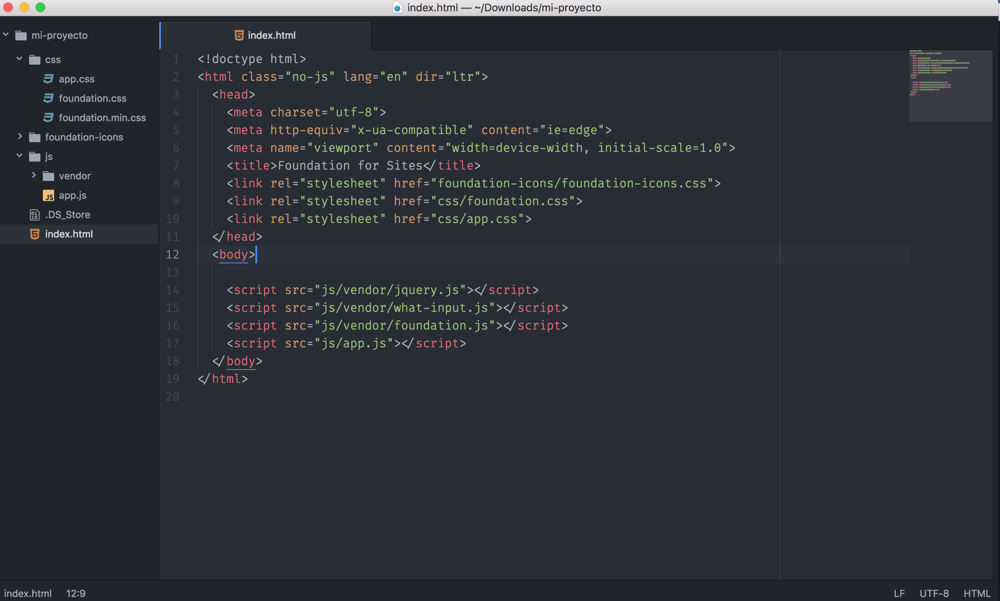
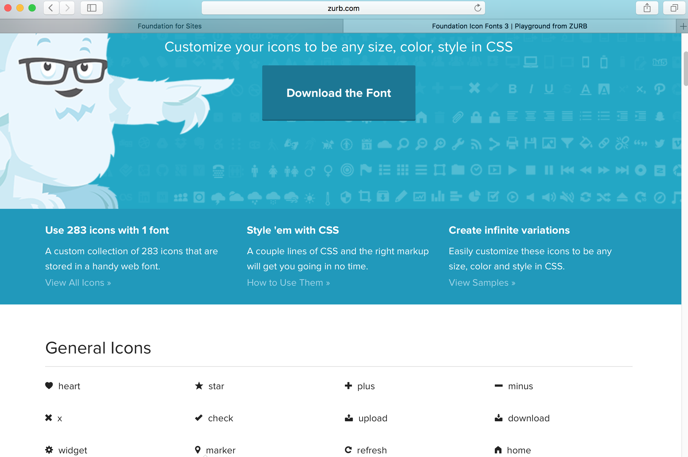
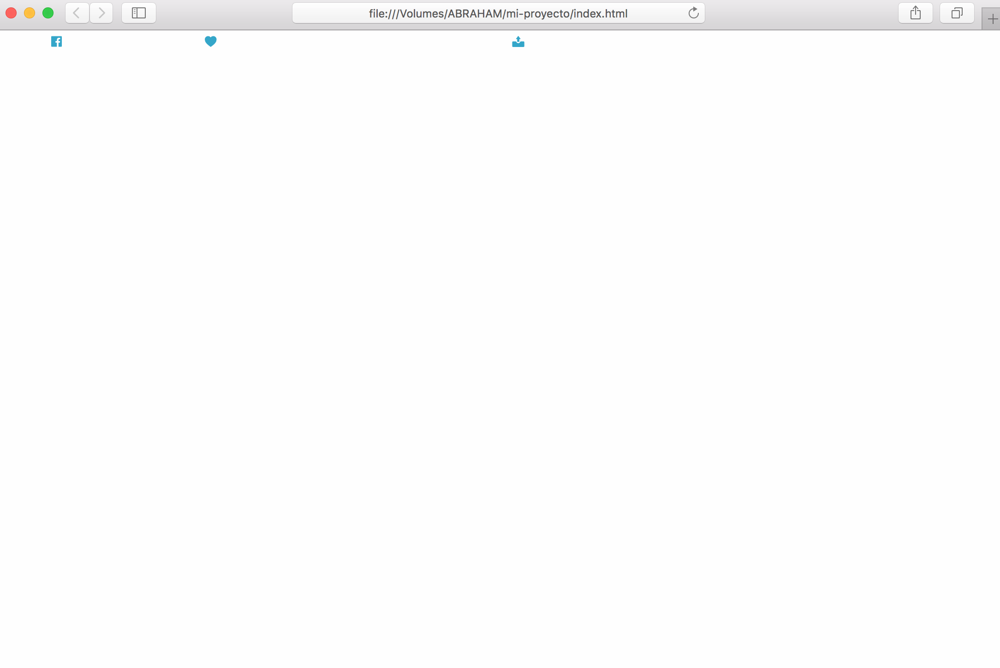
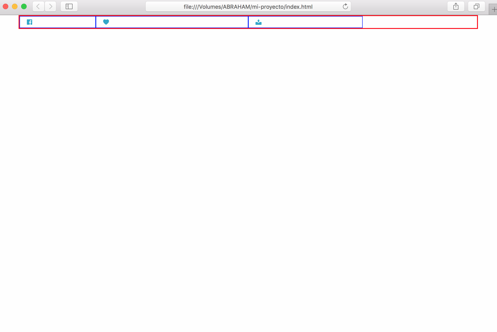
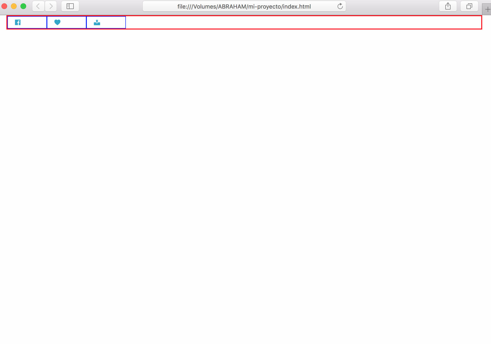
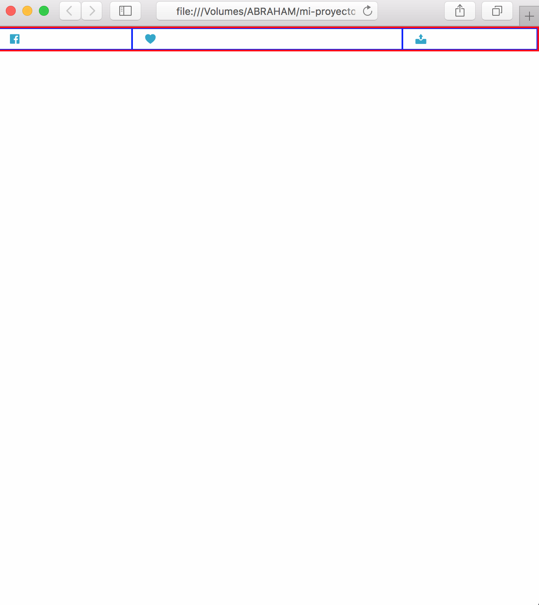
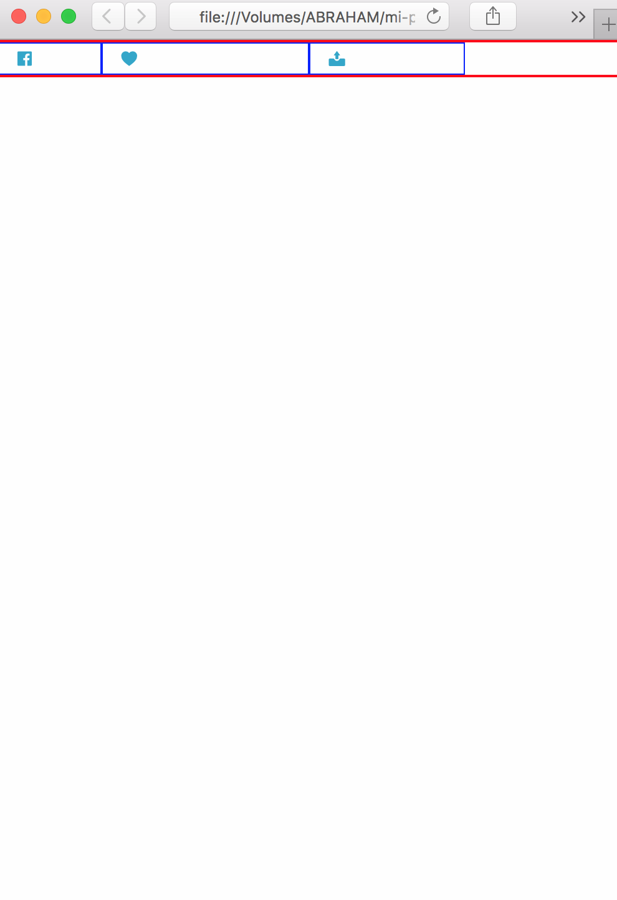

# Como funciona Foundation

Antes de empezar hagamos un ajuste a nuestro archivo **index.html**, como te habrás dado cuenta, por defecto trae estructuras ya creadas, sin embargo, nosotros queremos hacer nuestro propio proyecto, asi que se las quitaremos.

**Antes**


y así es como debe quedar:

**Después**



**IMPORTANTE!** Los scripts son necesarios para que Foundation funcione, así que hay que dejarlos.

Como te darás cuenta borré todo el contenido de estructuras dentro de la etiqueta `<body></body>` dejando unicamente los scripts de al final.

## Empezemos

Para empezar daremos sentido al concepto de [Grillas](page2.md) que mecionamos anteriormente.

Veamoslo con un ejemplo:

Piensa en cada estructura de Foundation como un contenedor, donde las `.row` son las cajas y las `.column` son el contenido dentro.

**Para buenas prácticas de programación yo sugiero dividir el código en secciones con un id. (No es necesario)**

Pongamosle una estructura para Redes sociales a nuestra página web

``` html
<section id="social-container">
  <div class="row">
    <div class="column">

    </div>
  </div>
</section>
```
Esta es la estructura básica, ahora, ¿Recuerdas que teniamos un paquete de iconos?, ha llegado la hora de usarlos.

## Agregando iconos a nuestra pagina web

La forma de insertarlos en nuestra página web es con el atributo `class="fi-[nombre-del-icono]"`.

``` html
<section id="social-container">
  <div class="row">
    <div class="column">
      <a href="#">
        <i class="fi-social-facebook"></i>
      </a>
    </div>
  </div>
</section>
```

El **nombre de los iconos** los puedes encontrar en la misma página donde los descargamos, en la parte de abajo.



agregemos unos cuantos más...

``` html
<section id="social-container">
  <div class="row">
    <div class="column">
      <a href="#">
        <i class="fi-social-facebook"></i>
      </a>
    </div>

    <div class="column">
      <a href="#">
        <i class="fi-heart"></i>
      </a>
    </div>

    <div class="column">
      <a href="#">
        <i class="fi-upload"></i>
      </a>
    </div>
  </div>
</section>
```

¿Te fijaste que cada `<div class="column"></div>` lo coloqué dentro de `<div class="row"></div>`?, como mencionamos las `.column` viven dentro de las `.row` de tal forma que nuestras filas son nuestras cajas y las columna nuestro contenido.

Ahora, nos faltó algo muy importante, agregar nuestras características para el diseño responsivo. A continuación utilizaremos los breakpoints que mencionamos anteriormente.

*Por defecto si no declaramos los breakpoints Foundation toma el ancho disponible de la pantalla*

## Agregando Responsive Design

Foundation tiene un número máximo de 12 columnas por fila. Veamos un ejemplo

``` html
<section id="social-container">
  <div class="row">
    <div class="column small-2">
      <a href="#">
        <i class="fi-social-facebook"></i>
      </a>
    </div>

    <div class="column small-4">
      <a href="#">
        <i class="fi-heart"></i>
      </a>
    </div>

    <div class="column small-3">
      <a href="#">
        <i class="fi-upload"></i>
      </a>
    </div>
  </div>
</section>
```
Cuando puse `small-[1 a 12]` lo que estoy diciendo es que, el contenido de mi `.column` ocupe un ancho de 2 columnas, 4 columnas y 3 columnas, que en total suman 9 columnas, por lo que no se pasan de las 12. Veamos como se ve esto en nuestra pagina web.



Apreciemoslo mejor poniendo unos bordes con .CSS



Nuestra fila esta representada con el color rojo y nuestras columnas con color azul, como te darás cuenta corresponde a nuestra declaración.
Nuestro icono de facebook dijimos que ocupe 2 columnas, el icono de corazon 4 columnas y el icono de carga 3 columnas, por lo que nos sobran 3 columnas que es el espacio que ves reflejado en la imagen.


### Mobile-First
¿Te diste cuenta que usamos unicamente `small-` (que solo era para pantallas móviles) y tomo esas medidas en pantalla de escritorio?

Este framework como algunos otros se basa en la característica **mobile-first**, esto quiere decir que la disposición de las columnas se heredadan de su antecesor(la disposición más pequeña), a menos que estas sean sobreescritas.

Mostremos un ejemplo de como se sobreescriben las disposiciones.

``` html
<section id="social-container">
  <div class="row">
    <div class="column small-2 medium-3 large-1">
      <a href="#">
        <i class="fi-social-facebook"></i>
      </a>
    </div>

    <div class="column small-4 medium-6 large-1">
      <a href="#">
        <i class="fi-heart"></i>
      </a>
    </div>

    <div class="column small-3 medium-3 large-1">
      <a href="#">
        <i class="fi-upload"></i>
      </a>
    </div>
  </div>
</section>
```
### Pantallas de Escritorio


### Pantallas de Tabletas


### Pantalla de Móviles


La forma de probar las distintas resoluciones es haciendo cada vez más pequeña, la ventana de tu navegador.

#### [Anterior](page5.md) -- [Siguiente](page7.md)
