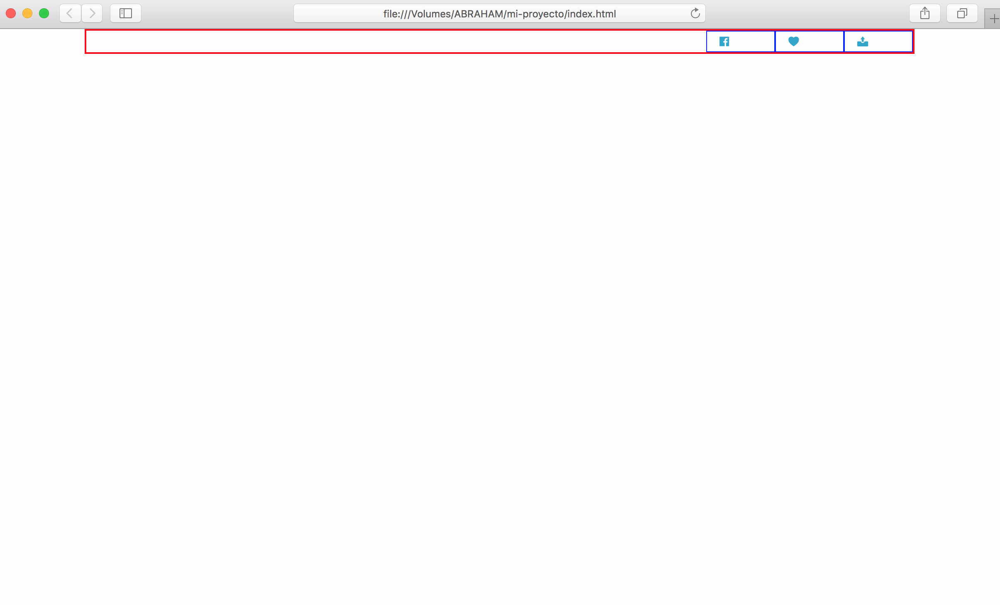
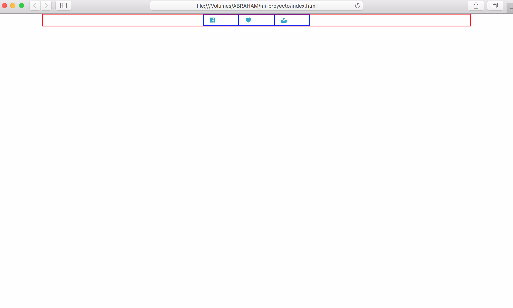
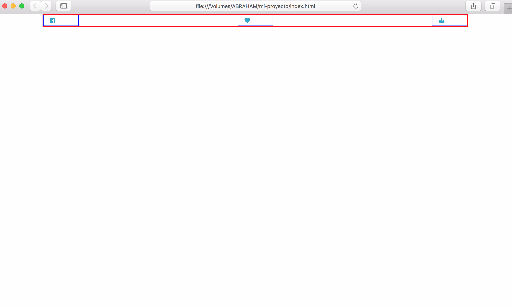
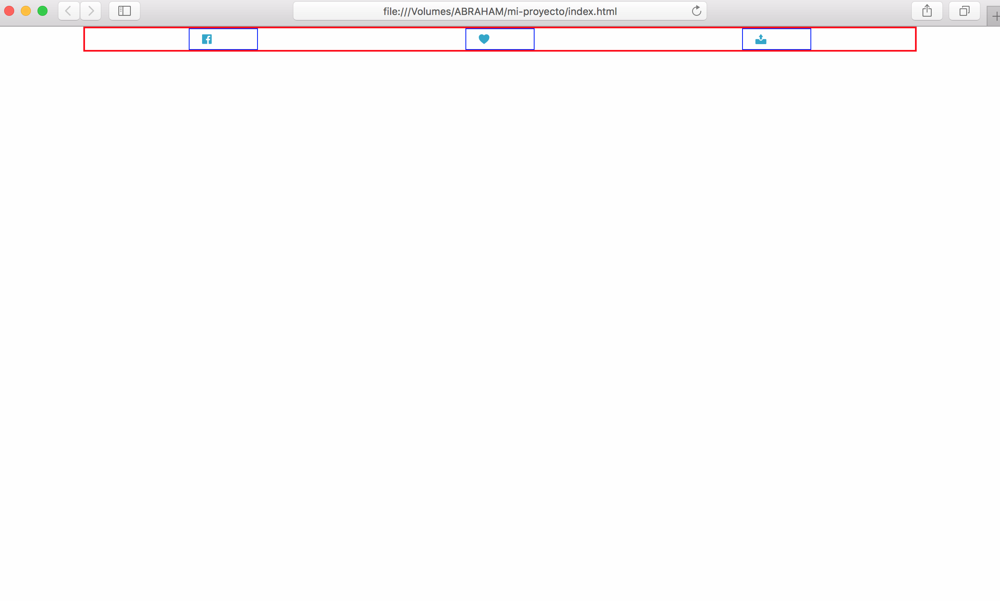

# Flex-Box

Foundation incorpora la característica *flex-box*, que es un modo de diseño que nos permite crear estructuras para sitios web de una forma mas fácil. *Recuerda que ésta característica aún no es soportada por todos los navegadores.* Sin embargo con el uso de herramientas o plugins externos como POSTCSS se puede arreglar.

## ¿Como funciona?

Cuando descargamos el archivo de nuestro proyecto marcamos la casilla *Flex-grid*, con esta pequeña configuración agregamos las caracteristicas flex-box de Foundation.

Foundation nos trae 4 alineamientos horizontales:

* `.align-right`

* `.align-center`

* `.align-justify`

* `.align-spaced`

Estos alineamientos funcionan agregandoselos al elemento ***contenedor*** de nuestros elementos, veamos el ejemplo.

En este caso, el elemento ***contenedor*** que tiene nuestros elementos es `<div class="row"></div>`

Tomemos como base este codigo:

``` html
<section id="social-container">
  <div class="row [tipo-alineamiento]">
    <div class="column small-2 medium-3 large-1">
      <a href="#">
        <i class="fi-social-facebook"></i>
      </a>
    </div>

    <div class="column small-4 medium-6 large-1">
      <a href="#">
        <i class="fi-heart"></i>
      </a>
    </div>

    <div class="column small-3 medium-3 large-1">
      <a href="#">
        <i class="fi-upload"></i>
      </a>
    </div>
  </div>
</section>
```

```html
  <div class="row align-right">
    ...
```


```html
  <div class="row align-center">
    ...
```


```html
  <div class="row align-justify">
    ...
```


```html
  <div class="row align-spaced">
    ...
```


*Por defecto los elementos vienen alineados a la izquierda, sin embargo, si se desea se puede ser explicito añadiendo* `.align-left`.

## Con estos fundamentos ya puedes agregar Foundation a tus páginas web. Espero te sea de ayuda 😃

#### [Anterior](page6.md)
