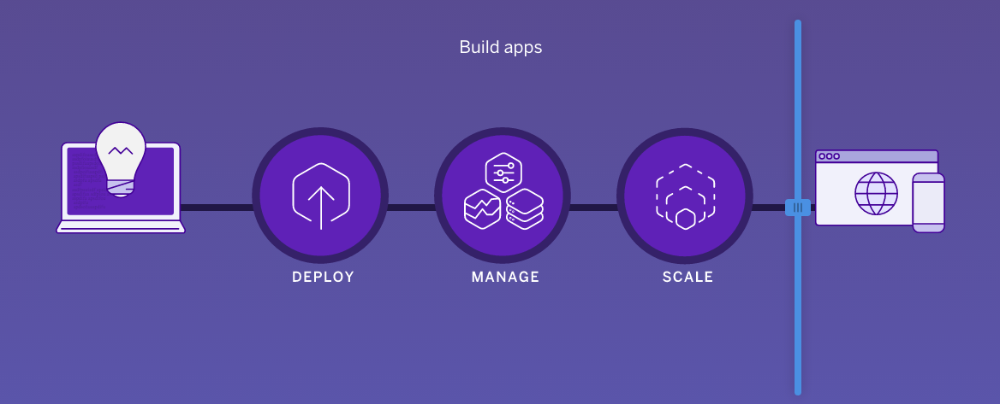
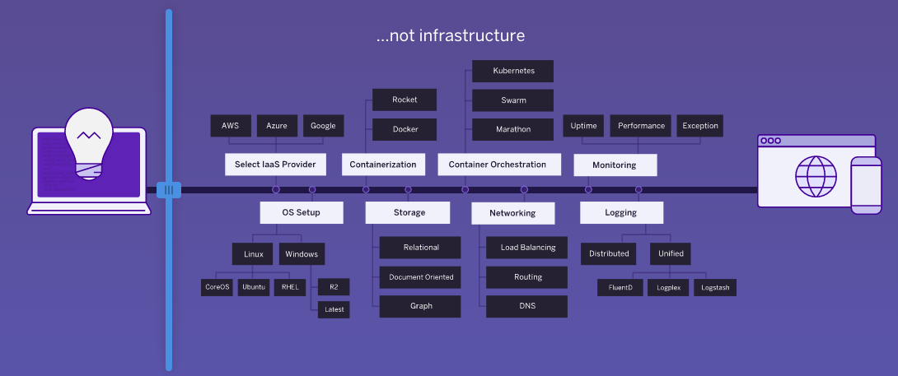
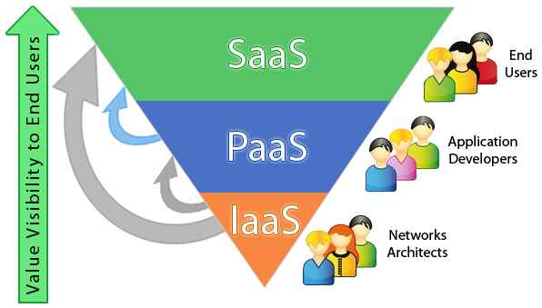
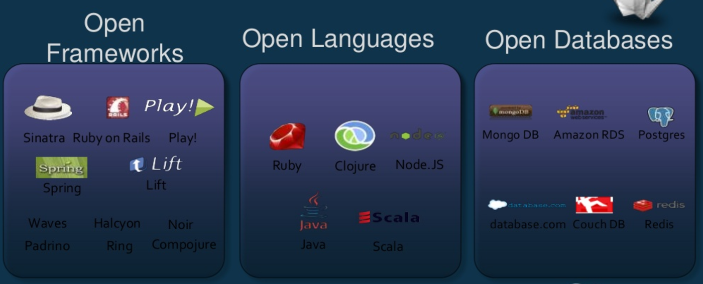

# Conceptos Básicos

## ¿Qué es Heroku?

* Es una Plataforma como Servicio (PaaS).
* Su objetivo es reducir el tiempo de configuración de un servidor y maximizar el tiempo de desarrollo de nuestras aplicaciones.
* Al enfocar nuestro tiempo en el desarrollo de la configuración podemos enfocarnos en crear aplicaciones que realmente añadan mucho valor a nuestro negocio.
* Nos permite desplegar, correr, escalar, administrar y configurar fácilmente aplicaciones.

### Enfocarnos en..

### Olvidarnos de..

#### Something... as a Service

IaaS (Infrastructure as a Service), PaaS (Platform as a Service) and SaaS (Software as a Service) son modelos de servicio de computación en la nube.

## Algunos componentes

Una infraestructura para desplegar una aplicación requiere de la configuración de diversos compoentes que deberán interactuar juntos para lograr la construcción, ejecución y administración de una aplicación.
* Servidores de Aplicaciones
* Bases de Datos
* Respaldos (Backups)
* Balanceadores de Carga (Load balancer)
* Certificados SSL
* Firewalls
* Cache
* Logging
* Monitoreo

### Olvidate de los Servidores

#### ¿Qué es un Dyno?

Un recurso autónomo en el cual podemos ejectuar nuestra aplicación. ([Un contenedor de Linux](https://linuxcontainers.org/)) Ofrecen una abstracción lógica más sencilla que los servidores de aplicación.

Dentro de un Dyno podemos encontrar:
* Contenedores embebidos (Jetty, Tomcat)
* Dependencias de nuestras aplicaciones (Maven, Gradle, Bundle, etc)
* El código de nuestra aplicación (Rails, NodeJS, Django, etc)

Por lo tanto, nuestra aplicación se encontrará contenida en un **Dyno** totalmente administrado por Heroku, en pocas palabras Heroku se vuelve nuestro [DevOps](https://es.wikipedia.org/wiki/DevOps) ... de cierto modo.

### Ejecuta lo que sea

Heroku se define como *una plataforma como servicio elástica y [políglota](https://es.wikipedia.org/wiki/Pol%C3%ADglota)*, debido a que ofrece soporte para una gran variedad de lenguajes, frameworks y bases de datos.

## Servicios Adicionales (Addons)

* Memcache
* Redis
* MongoDB
* Email
* App Performance
* Logging

## [Anterior](PAGE1.md) - - [Siguiente](PAGE3.md)
