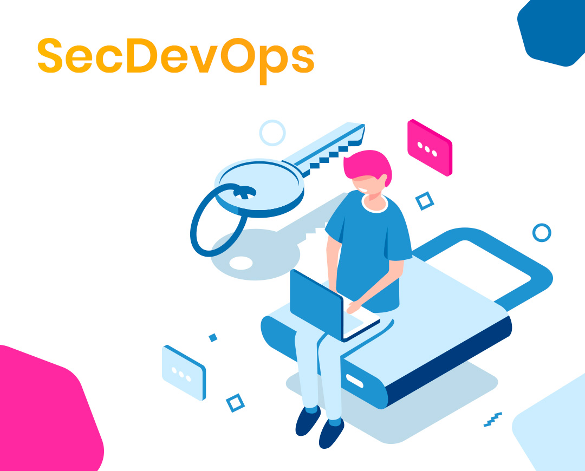

Seguramente te ha pasado que al hacer un programa, funciona a la perfección en tu computadora pero al probarlo en otro equipo este programa falla ¿Por qué sucede esto? Existen muchas posibles razones, podría ser un cambio de configuración del ambiente en donde está corriendo, distintas versiones del sistema operativo, entre otros. Pero lo menos importante es la razón por la que esto sucede, lo importante es considerar estos riegos y evitar que sucedan ya que en ambientes laborales estos fallos significan pérdidas económicas o de prestigio.

# ¿Qué es DevOps?

DevOps más que una profesión es una cultura y una serie de prácticas así como un conjunto de herramientas 
que nos ayudan a crear y mantener software de manera ágil para los usuarios.
Tiene como objetivo principal minimizar el tiempo de entrega de nuevas versiones de software así como asegurar también la calidad de este.

## Dev
Se encarga de escribir el código para la aplicación asegurandose de la calidad del código y que no haya huecos de seguridad.

## Ops
Se asegura que el código creado por el desarrollador corra configurando servidores, redes,entre otras infraestructuras. 
En otras palabras, se encarga de que las máquinas funcionen y puedan ejecutar el código dentro
de ellas.

## DevOps
Es la definición de superhéroe, se encarga de todo el proceso desde el momento en que se
escribe el código hasta que se pasa a producción tomando en cuenta que todo este proceso 
sea seguro, automatizado y de calidad.

## Procesos y lo que necesito saber
**Comunicación.** Es crucial que las personas encargadas del trabajo, ya sea desarrolladores
o los equipos de TI, se mantengan en constante comunicación para saber qué tarea tiene asignada
cada persona y poder agilizar el trabajo.

**Pruebas automatizadas.** Correr pruebas unitarias continuamente para asegurar la calidad 
del código.

**Continuous Integration.** Son pasos definidos por ti mismo para realizar pruebas después de
integrar el código del equipo de desarrolladores para detectar errores o vulnerabilidades antes
de hacer un despliegue.

**Continuous Delivery.** Es la forma de enviar nuevas versiones del producto de software a
nuestro cliente de forma continua, es decir si las pruebas pasadas fueron existosas se podría 
hacer un despliegue automático de las nuevas caracterísiticas añadidas y el cliente podría verlos
en el menor tiempo posible.

